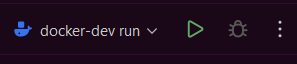

# FreeEdu

FreeEdu is plug and play e-journal system for schools. It is designed to be easy to use and easy to deploy. It is written in Java and uses Spring Boot.

## Features

- TODO: Add feature list

## Getting Started

To get started with FreeEdu, follow these steps:

### Deployment
Application is deployed od docker containers. Containers to run require a .env file.

```bash
cp env.dev .env
```
Now you can run the application using docker-compose (required prepered JAR file).

```bash
docker-compose up
```

Prepering JAR file:
```bash
mvn clean package -DskipTests
```

Or use prepared run configuration ,,docker-dev-run" in your IDE in right top corner ([docker-dev run.run.xml](.run%2Fdocker-dev%20run.run.xml)).



This configuration will create new JAR file and run two docker containers with application and database.
Database will be created with initial tables, and will save data on host computer.
#### To delete data saved locally ####

```bash
docker volume rm postgres_data
```

#### IP ####
- **Docker-app: 127.0.0.1:8080**
- **Docker-db: 127.0.0.1:5432**
- **local-app: 127.0.0.1:8081**

To change ports of containers, you can use [docker-compose.override.yaml.example](docker-compose.override.yaml.example)docker-compose.yaml file. 

## Debugging
Debugging application is easy as run only one container with database from docker-compose.yaml file.
With database running you can run application in debug mode from your IDE.
